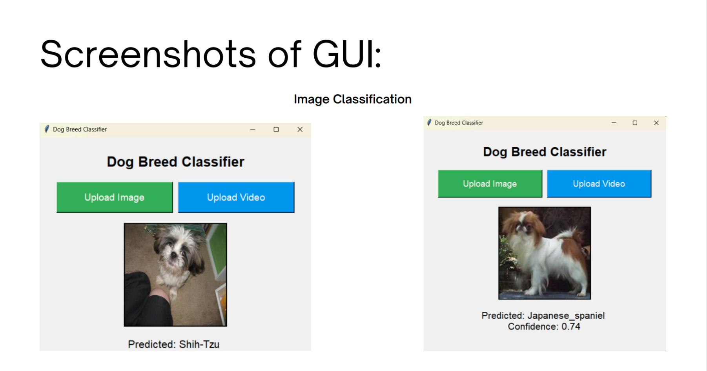
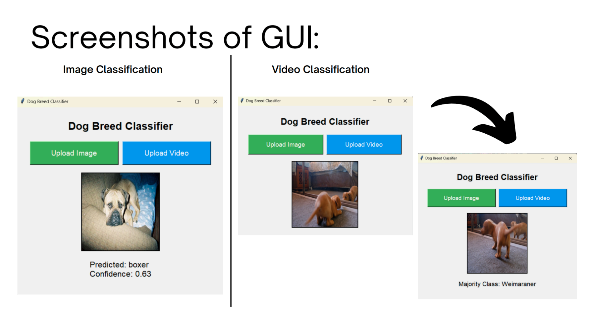
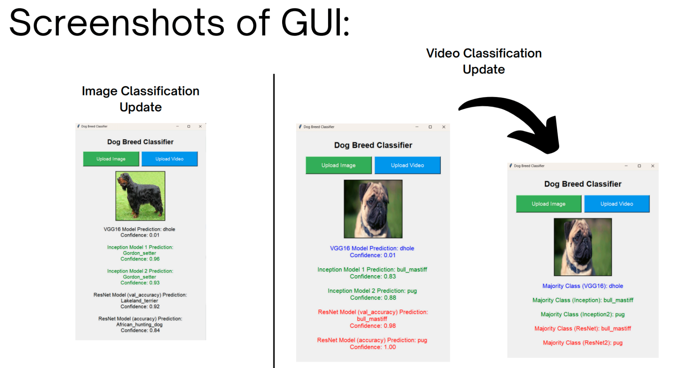

# Dog Breed Classification

## Project Description
Dog Breed Classificaton App uses Transfer Learning (VGG16, Inception and Resnet50) to predict the dog breed of any dog image, or video with a dog in it.  

## Methodology
Methodology

Dataset Preprocessing

The dataset is organized in folders, with each folder representing a different breed. The images are preprocessed using Keras' ImageDataGenerator for both real-time data augmentation and rescaling. This augmentation step is essential to prevent overfitting and help the model generalize better on unseen data.

Key preprocessing steps include:

1. Rescaling: Images are rescaled by dividing pixel values by 255 to normalize the input data.

2. Augmentation: To enhance generalization, the training images are augmented with random rotations, zoom, shifts, and horizontal flips.

The dataset was split into training and validation sets, and each image was resized to match the input size required by InceptionV3 and ResNet50 models (299x299 for Inception and 224x224 for ResNet). Labels were extracted from folder names and one-hot encoded for multi-class classification(Methodology).

Model Architecture and Training

Two architectures, InceptionV3 and ResNet50, were used for transfer learning.

1. InceptionV3: 

o This architecture includes inception modules that use multi-scale convolution filters to capture different features. It is particularly useful for handling complex images with fine-grained features, which is essential for distinguishing between similar dog breeds(Methodology).

o The pre-trained InceptionV3 model was used with its top layers replaced by a dense layer (1024 units) and a softmax output layer for 120-class classification. The model was compiled using the Adam optimizer with categorical cross-entropy loss and accuracy as a metric.

2. ResNet50:

o ResNet50 is designed with residual blocks that enable training deeper networks without performance degradation caused by vanishing gradients. The model's residual connections make it effective for extracting subtle features between similar classes of dogs(Methodology).

o Similarly, ResNet50's top layers were replaced with a custom classifier. It was trained with the same settings as InceptionV3, allowing for comparison between the two architectures.

Both models were trained using ImageDataGenerator to provide augmented batches of images. The training was done with a batch size of 32 for 20 epochs, but early stopping was used to prevent overfitting.

Callbacks and Optimization

Three key callbacks were used to optimize the training process:

1. ModelCheckpoint: This callback saves the model with the best validation accuracy during training.

2. EarlyStopping: This stops training if the validation loss does not improve for 5 consecutive epochs, ensuring that the model does not overfit.

3. ReduceLROnPlateau: This callback reduces the learning rate when the validation loss plateaus, allowing the model to converge more efficiently.

These callbacks help the model optimize its performance while preventing unnecessary epochs and overfitting.

### Screenshots
- **Dog Image Predictions**

### How to Use
- **Download All Files**
- **Install Required Libraries**
- Run Gui File (GuiFile.py)

- Train File is the back end code. For this please download stanford dog dataset from http://vision.stanford.edu/aditya86/ImageNetDogs/ 

Thank you!!!
